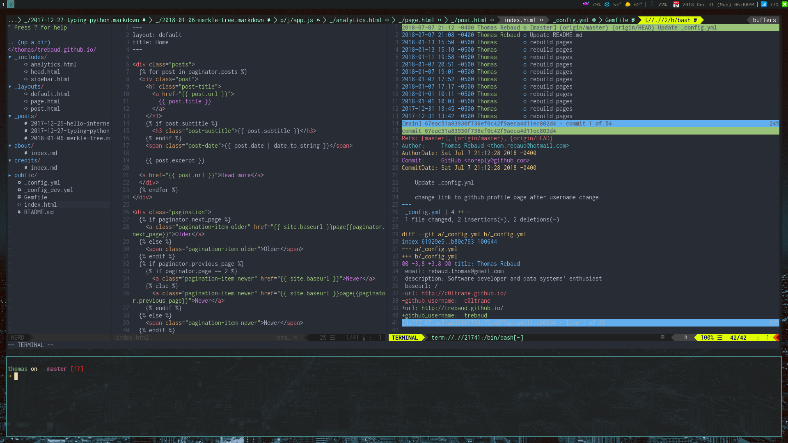

# Dotfiles

Here you will find my dotfiles, use them as you please. This is intended to provide a minimalistic development environment and you will find more complete configurations elsewhere.

The setup script installs the following programs:

* [tmux](https://github.com/tmux/tmux)
* [tig](https://github.com/jonas/tig)
* [zsh](www.zsh.org) and [oh-my-zsh](https://github.com/robbyrussell/oh-my-zsh)
* [spaceship-prompt](https://github.com/denysdovhan/spaceship-prompt)
* [Neovim](https://github.com/neovim/neovim)
* [Plug](https://github.com/junegunn/vim-plug)
* [Powerline-fonts](https://github.com/powerline/fonts)

As well as the following dependencies and useful libraries for development:

* nodeJS/npm
* curl

Clone this repository and run the setup script. To install individual programs send in additionnal arguments with the install parameter.

``` bash
  $ ./setup.sh -i=tmux;zsh;tig
```



